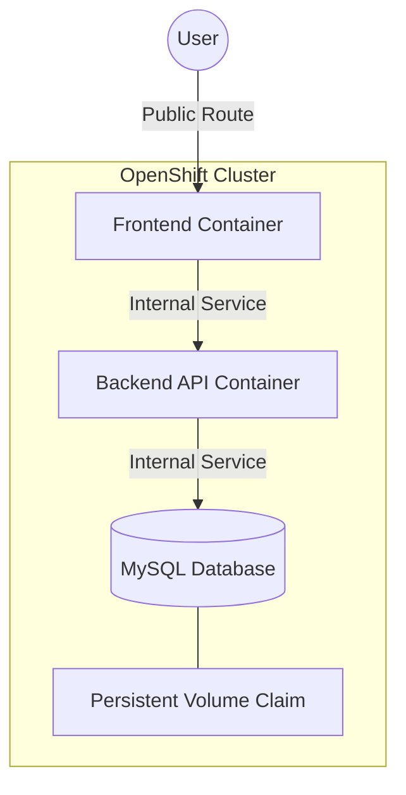

# CloudVault Architecture - OpenShift Deployment

This document outlines the microservices architecture and design decisions for CloudVault as deployed on the Red Hat OpenShift platform.

## Architecture Overview

CloudVault is designed as a set of loosely coupled microservices that interact to provide a secure cloud storage experience.



## Scaling Strategy

CloudVault leverages OpenShift's **Horizontal Pod Autoscaler (HPA)** and **DeploymentConfigs** to ensure high availability and performance:

1.  **Horizontal Scaling**: Both the Frontend and Backend can be scaled to multiple replicas using:
    ```bash
    oc scale dc/backend --replicas=3
    oc scale dc/frontend --replicas=3
    ```
2.  **Load Balancing**: OpenShift **Routes** and **Services** handle traffic distribution across healthy pods automatically.
3.  **Rolling Updates**: Updates are deployed using a "Rolling" strategy, ensuring zero downtime by updating pods one at a time.

## Data Persistence

- **MySQL Storage**: Data is persisted using an OpenShift `PersistentVolumeClaim` (`mysql-data`). 
- **Persistence Across Restarts**: Even if the MySQL pod is restarted or moved to another node, the storage is reattached, ensuring no data loss.

## Communication Mechanisms

1.  **Routes**: Used to expose the Frontend to the public internet.
2.  **Services**: Used for internal communication between containers (e.g., `backend` service is accessible at `http://backend:4000`).
3.  **Environment Linkage**: The Frontend's `NEXT_PUBLIC_API_URL` is configured to point to the backend service, ensuring seamless integration within the cluster.

## Security

- **OpenShift Secrets**: Sensitive data like database passwords and JWT keys are stored in encrypted `Secrets`.
- **JWT Authentication**: All communication between the Frontend and Backend is secured via JSON Web Tokens.
